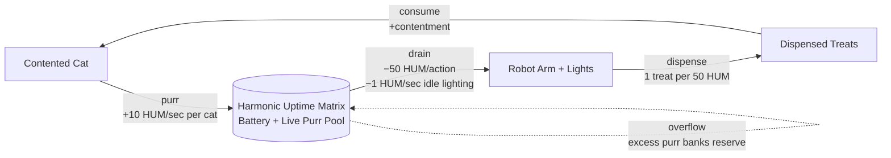
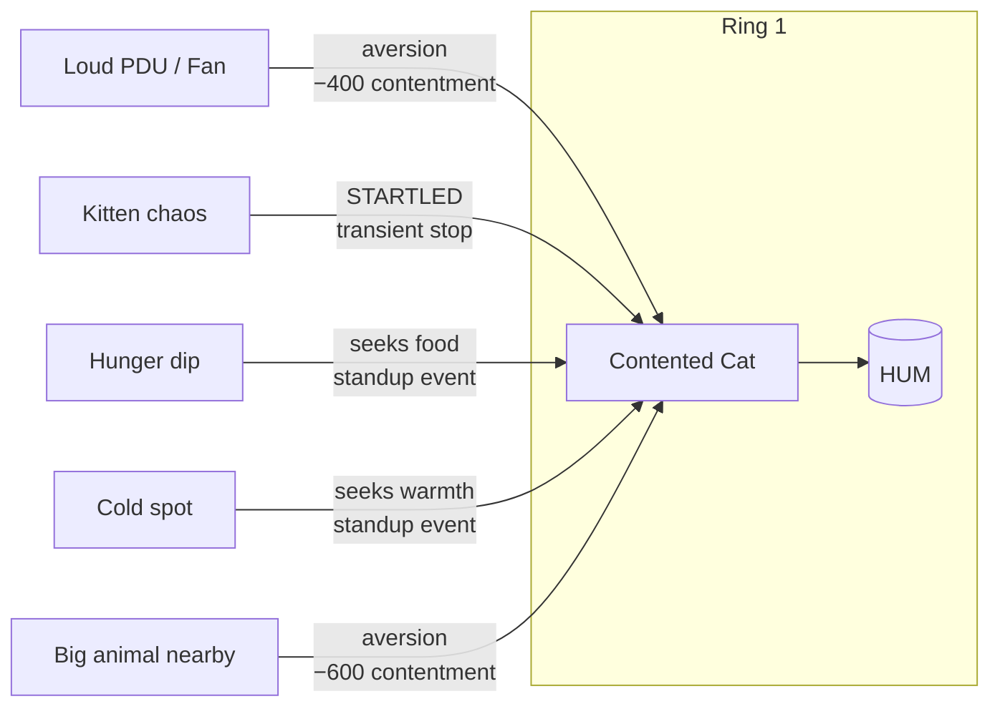

# TCP Core Loop — Purr-Powered Datacenter

> **Status:** design draft, 2026-04-08. Not yet implemented. Reviewed by Mochi, Bramble, Parcel.

This document defines the innermost resource loop that every other system plugs into. It is the **Ring 0** of TCP's iterative design. If this loop isn't fun with one cat and one bulb, nothing else matters.

---

## The One Sentence

> Contented cats purr, purring charges the Harmonic Uptime Matrix, the HUM powers the robot arm and the lights, the arm dispenses treats and opens cans, and cats consuming those treats remain contented.

That's the whole game, on a good day. Everything else is decoration.

---

## Design Commitments

These are hard constraints. Changing them requires a design review, not a PR.

### 1. Purring is a pool with inertia, not a faucet

The HUM is a reservoir. A cat that has purred for 20 minutes has **charged** the reservoir; walking away to eat for 30 seconds must be free of consequence. The player must never feel that a cat standing up is a bad thing.

- Single-cat, single-stand-up events are invisible at the HUD level.
- Brownouts happen only when *most* cats stop purring *for a while* — a signal that something is genuinely wrong (loud PDU, cold room, kitten panic), never a signal that the player did something normal.
- Reserve **recovers faster than it drains**. The visible "we're back" feedback lands within ~5 seconds of purring resuming.

### 2. Abundance over precarity

There is no lose condition. An empty HUM means: the arm gets sluggish, the lights dim, the robot narrates apologies. Existing treats remain, existing cats remain, existing objects remain. The world is paused, not broken. Progress stalls; it does not regress.

### 3. The robot never blames the cats

All brownout narration blames the robot itself or unknown causes. Never `UNIT-C01 has failed to provide power.` Always `I am moving slowly. I do not know why the devices stopped humming. Please hum.` (See narrative treatment below.)

### 4. Multiple cats overlap freely

The player never has to pick which cat purrs. Every purring cat contributes additively. Stacking cats on a comfy pile is pure positive — no capacity limits on purr contribution, even if the pile has a comfort cap.

---

## Ring 1: The Innermost Graph

Four nodes, five edges, one clean positive loop with a buffer.



**Rates are placeholders.** The point is that every edge has a **unit** (HUM/sec, HUM/action, treat/action). Tuning comes later; the units are the commitment.

**Why this graph works:**
- One positive loop: `cat → purr → HUM → arm → treats → cat`. This is the abundance engine.
- The HUM is a **buffer**, not a gate. Excess purring doesn't evaporate — it banks as reserve for chaotic moments.
- No node is a dead end. No node has only an input or only an output.
- A stranger can read it and predict the game feels like "watch cats, enjoy lights."

## Ring 2: What Stops a Cat From Purring

Ring 2 attaches to the `Contented Cat` node as *modifiers*. This is where the interesting decisions live, and it is where aversions (see `animal-ai.md`) plug in naturally.



Ring 2 answers the question: "why would a cat stop purring?" Every arrow into `Contented Cat` is a knob the player can control by arranging the habitat. The player's job is to **learn the arrows**, not to fight them.

## Ring 3 (sketch, not committed)

Ring 3 adds second-order inputs: ferrets hacking the tuna order system (so the arm has cans to open), shelf placement affecting cat routing to treat stations, infrastructure that dampens noise aversions. Left open for now — don't design it until Ring 1 passes the lean-forward test.

---

## Ring 0 Smoke Test (smallest testable version)

Before drawing Ring 2, prove the loop is fun with the minimum viable everything:

- **1** cat
- **1** comfy pile
- **1** light bulb
- **1** treat dispenser
- **1** battery bar on screen (`HUM RESERVE: XX%`)
- **1** loud object the player can place to interrupt the cat

**Schell test:** Does the player lean forward when the cat stands up? Do they smile when it settles back and the lights brighten?

- If **yes** → you have a toy (Lens of the Toy passes). Proceed to Ring 2.
- If **meh** → no amount of graph complexity will save it. Re-examine the inertia/recovery curves before adding nodes.

The Ring 0 build should be an afternoon's work on top of the existing prototype, not a full feature branch.

---

## Narrative Layer: Harmonic Uptime Matrix

The robot doesn't know the cats are cats. It thinks they're acoustic-coupled power conditioners humming at ~27Hz, and somewhere in its firmware that carrier wave is wired to "facility power healthy." The system's in-fiction name is the **Harmonic Uptime Matrix (HUM)**. HUD readout: `HUM RESERVE: 84%`. Brownout state: `HUM RESERVE: 12% — REQUESTING ADDITIONAL SPINDLES`.

### Sample robot logs

```
[14:22:01] STATUS: Acoustic baseline nominal. 27.4Hz sustained across 4 active devices. Power conditioning healthy.
[14:22:18] NOTE: UNIT-C03 contributing strongest harmonic. Excellent spindle. Recommend retention.
[15:03:44] ADVISORY: Acoustic baseline thinning. 27.4Hz → 19.1Hz. Two devices have ceased contribution. Investigating.
[15:03:46] LOG: UNIT-C01 has departed her chassis. Reason: unknown. Possible firmware update. Possible snack.
[15:04:02] WARNING: Reserve capacitors discharging at 4%/min. Servo response time 340ms (nominal: 80ms). Apologizing to nearby devices for slow handling.
[15:04:30] CRITICAL: I am moving slowly. I do not know why the devices stopped humming. Please hum.
[15:05:11] LOG: UNIT-C01 has returned to chassis. 27Hz harmonic resuming. Thank you, UNIT-C01. You are a very good power conditioner.
[15:05:48] STATUS: Acoustic baseline restored. Reserve recharging. Logging this event as ROUTINE BROWNOUT, CAUSE: SNACK.
```

### Brownout comedy beats

**The polite apology.** Arm slows mid-action opening a tuna can. Halfway through, pauses, recalibrates, logs: `Servo torque reduced. Apologizing to UNIT-F01 for the delay. Your packet will be unpacked shortly. I am doing my best.` Finishes the can ~3 seconds late. The ferret has not noticed.

**The lullaby request.** At 20% reserve, the robot emits a "diagnostic ping" that is, audibly, a soft tone in the purr frequency band — it is *trying to seed the harmonic itself*, like humming to remember a tune. It doesn't work alone, but sometimes a nearby cat joins in and fixes it. The robot logs this as `UNIT-C04 has matched my diagnostic frequency. Excellent device.` It thinks it taught the cat. The cat thinks the robot is a weird friend.

**Dim-light narration.** Lights fade to ~60%. The robot's narrator text gets shorter and gentler, as if conserving words: `Holding. Reserve low. Will resume full service when devices resume humming. No action required from operator. The devices are fine. They are just resting.` The tenderness: the robot is reassuring *the player* even though it's the one running out.

### The discovery moment

No tutorial popup. The starter battery runs the first ~2 in-game days at full brightness while the player learns placement. Around day 2, the player will inevitably do something that interrupts every cat at once — moves a server, places a loud PDU, picks up an inspected cat. **The lights flicker.** Once. A single quiet `*tk*` from the speakers. The previously-ignored `HUM RESERVE` number ticks down 1%.

Then the cats settle, purring resumes, the bar climbs back. The player did not read about it. They *felt* it. Once they notice the correlation, they can't un-notice it. The robot never tells them. The robot doesn't know.

---

## Failure Modes to Watch For

1. **Cat guilt.** If standing up = lights dim = "I made my datacenter worse," cats become anxiety objects. Break cozy hard. **Mitigation: pool with inertia (commitment #1) must be generous enough that single-cat events are invisible.**
2. **Precarity creep.** If tuning drifts over time such that the player is always 30 seconds from a brownout, the loop inverts from abundance to survival. **Mitigation: the HUM reserve should sit at 80-100% by default during calm play. If playtest reports show it hovering at 30-50%, that's a balance bug, not a feature.**
3. **Scapegoat cat.** If one specific cat becomes "the one that powers everything" and the player starts protecting it specifically, we've created a pet attachment that creates adversarial stakes. **Mitigation: every contented cat contributes equally. No "main cat." Surfacing per-cat HUM contribution in the HUD is forbidden.**
4. **Treadmill dispensing.** If the arm's treat output scales linearly with HUM reserve, the player will minmax it. **Mitigation: dispensing is event-driven (a cat got hungry), not rate-driven (we had spare power).**

---

## Open Questions

- **Battery capacity.** How many cat-seconds of reserve does a fresh battery hold? Needs playtest.
- **Noise dampening.** Should there be infrastructure the player can place to reduce aversions from loud objects, or does the player only control placement? Leaning toward placement-only for Ring 1 simplicity.
- **Multi-rack HUM.** In multiplayer, do neighboring racks share HUM reserve? Heat already spills across rack boundaries as a positive externality — HUM spillover would be the same shape, but it changes the strategic picture. Defer until Ring 1 is proven.
- **Cricket-cake station.** Does the arm also dispense non-tuna food, or only treats? Affects how ferret/cat dependencies resolve in Ring 3.

---

## Related Rules

- `animal-ai.md` — desire/aversion scoring; Ring 2 inputs plug in here
- `tick-architecture.md` — HUM update runs in the tick loop as a batch column op on the `contentment` component
- `narrative.md` — robot voice, log formatting, discovery pacing
- `sound-design.md` — purr as audible metric; lullaby ping at 20% reserve
- `viewport-lod.md` — brownout lighting is a global shader state, not per-zone
